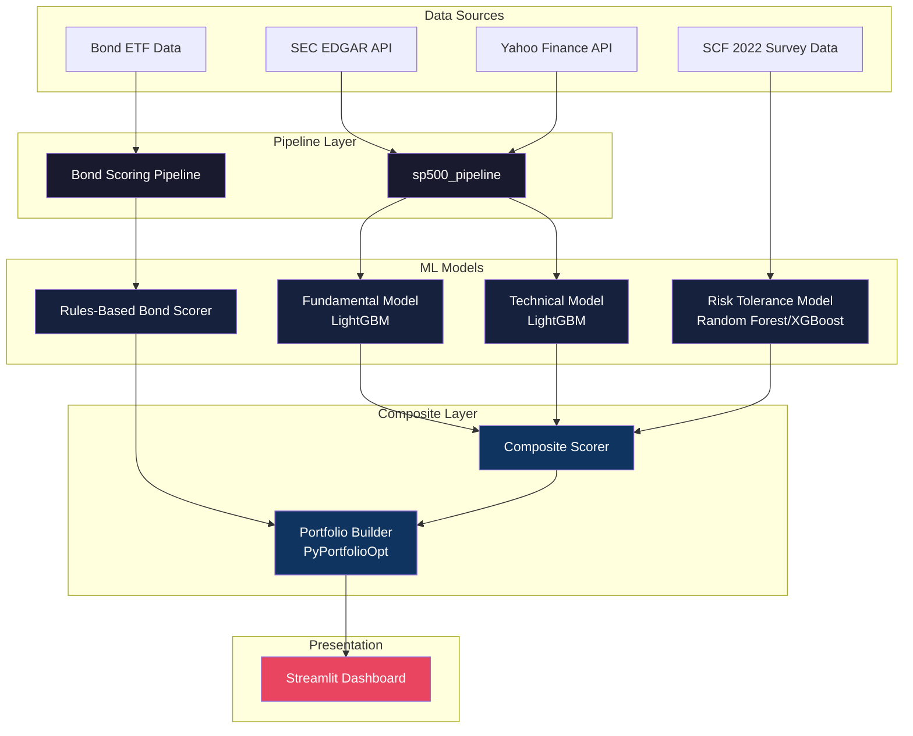
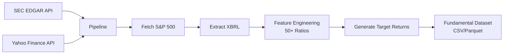
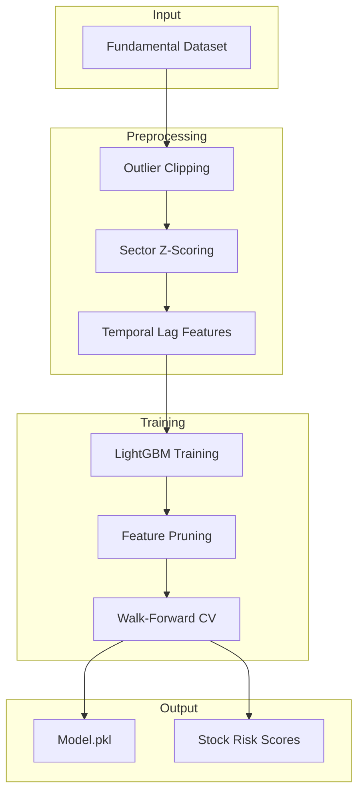
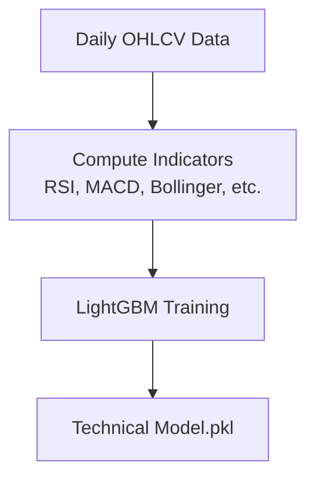
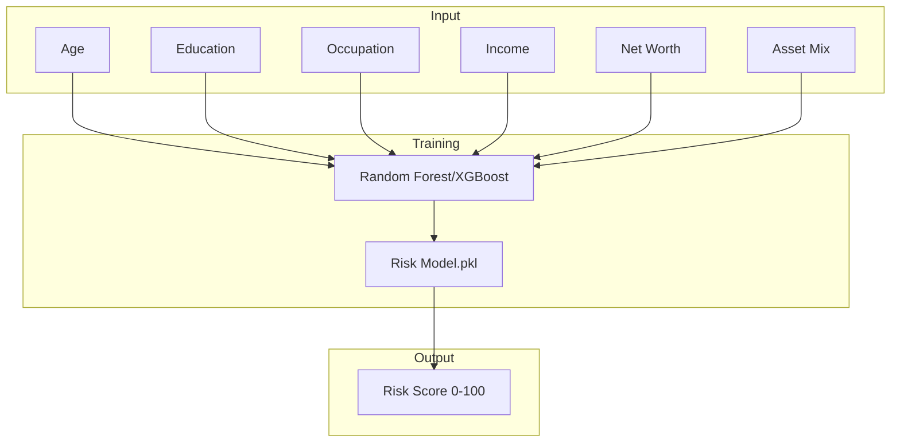
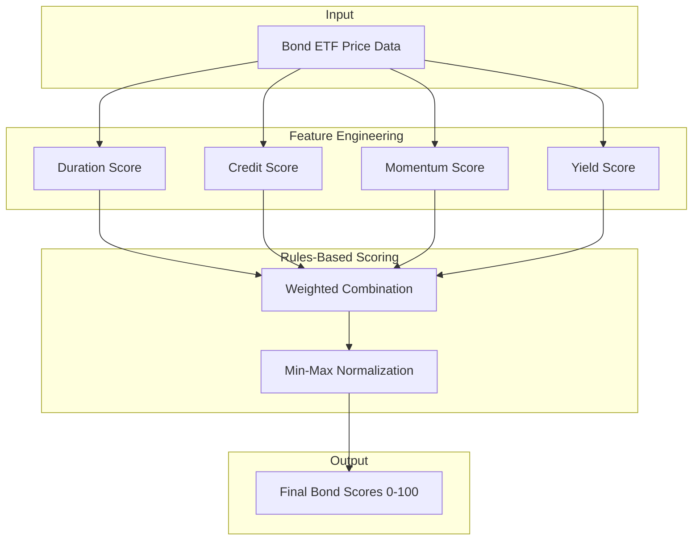
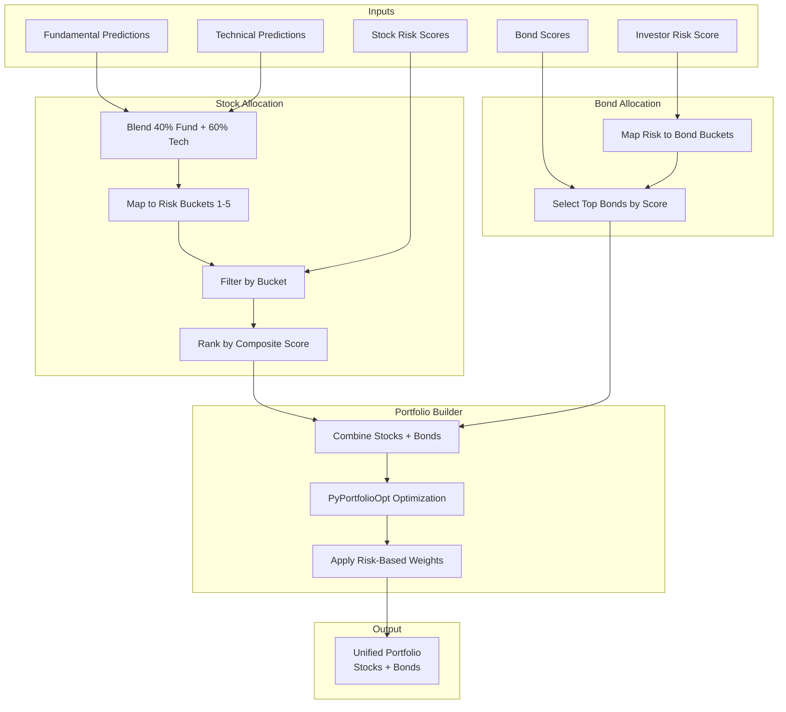
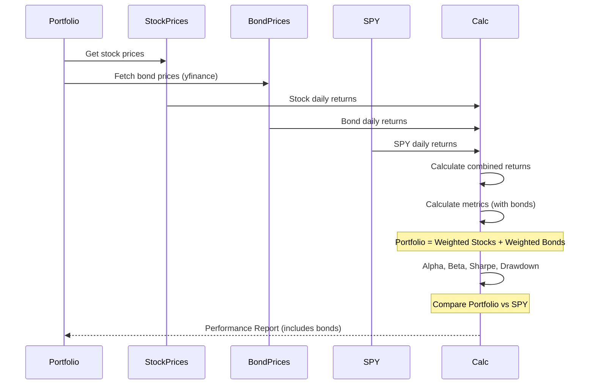
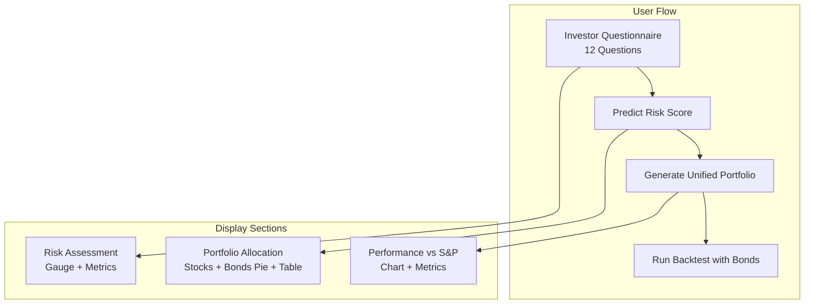

# 📊 Predictive Asset Allocation System

An end-to-end, AI-powered investment platform that orchestrates data retrieval, machine learning, and risk-matched portfolio optimization for the S&P 500 universe. Now includes **bond scoring and unified portfolio construction**.

---

## 🏗️ System Architecture



---

## 📂 Project Structure

```
.
├── sp500_pipeline/          # Data ingestion & ETL from SEC EDGAR
├── sp500_ml/                 # Fundamental analysis ML model
├── sp500_technical/         # Technical analysis ML model
├── risk prediction/         # Investor risk tolerance model
├── bond_ml/                 # Bond scoring pipeline
├── composite/               # Portfolio construction & optimization
├── gui/                     # Streamlit web interface
│   ├── components/          # UI components (charts, tables, etc.)
│   ├── core/                # Business logic (portfolio, backtest)
│   └── styles/              # Custom CSS theming
├── output/                  # Fundamental model outputs
├── output_technical/        # Technical model outputs
├── output_bond_ml/         # Bond scores output
├── output_composite/        # Portfolio outputs
└── daily_prices_all.csv     # Historical price data
```

---

## 🔄 How It Works

### 1. Data Pipeline (`sp500_pipeline`)



**Key Features:**
- Fetches company list from S&P 500
- Extracts XBRL financial statements (Balance Sheet, Income Statement, Cash Flow)
- Computes 50+ financial ratios (ROE, Debt-to-Equity, Operating Margin, etc.)
- Generates forward-looking excess returns relative to SPY

---

### 2. ML Models

#### 2.1 Fundamental Model (`sp500_ml`)



**Process:**
1. Preprocessing: Outlier clipping, sector-based z-scoring, temporal lag features
2. Two-pass training to identify high-impact features
3. Walk-forward cross-validation for robust validation
4. Generates Stock Risk Scores (0-100) based on model uncertainty, volatility, sector stability

#### 2.2 Technical Model (`sp500_technical`)



**Indicators Used:**
- RSI (Relative Strength Index)
- MACD (Moving Average Convergence/Divergence)
- Bollinger Bands
- Moving Average Crossovers
- ADX (Average Directional Index)
- Volume Profiles

#### 2.3 Risk Tolerance Model (`risk prediction`)



**Description:**
- **Source:** 2022 Survey of Consumer Finances (SCF) dataset with ~30,000 households
- **Model:** Random Forest / XGBoost classifier
- **Features:** Age, Education, Occupation, Income, Net Worth, Asset Mix
- **Output:** 0-100 Investor Risk Score

---

### 2.4 Bond Scoring System (`bond_ml`)



#### Bond Scoring Methodology

The bond scoring system uses a **rules-based approach** (not ML) combining four key factors:

| Factor | Weight | Description |
|--------|--------|-------------|
| **Duration Score** | 25% | Inverse of bond duration (shorter duration = higher score) |
| **Credit Score** | 25% | Based on credit quality (investment grade = higher) |
| **Momentum Score** | 25% | 6-month price momentum (positive = higher) |
| **Yield Score** | 25% | Yield relative to duration (better risk-adjusted yield = higher) |

**Scoring Formula:**
```
bond_score = 0.25 * duration_score + 0.25 * credit_score + 0.25 * momentum_score + 0.25 * yield_score
```

**Bond Categories:**
| Category | ETFs | Risk Profile |
|----------|------|--------------|
| Short-Term Govt | SHY, VGSH, SCHO | Ultra Conservative |
| Intermediate Corp | IEF, VCIT, IGIB | Conservative |
| Broad Market | AGG, BND, IUSB | Moderate |
| Investment Grade Corp | LQD, BOND | Growth |
| High Yield | HYG, JNK | Aggressive |
| Emerging Markets | EMB | Ultra Aggressive |

---

### 3. Unified Portfolio Construction (`composite`)



#### Dynamic Allocation by Risk Profile

| Risk Score | Category | Stocks | Bonds | Cash |
|------------|-----------|--------|-------|------|
| 0-20 | Ultra Conservative | 98% | 0% | 2% |
| 21-35 | Conservative | 82% | 15% | 3% |
| 36-50 | Moderate | 84% | 13% | 3% |
| 51-70 | Growth | 93% | 5% | 2% |
| 71-85 | Aggressive | 98% | 0% | 2% |
| 86-100 | Ultra Aggressive | 100% | 0% | 0% |

**Key Features:**
- Weighted blending of Fundamental (40%) and Technical (60%) predictions
- Maps investor risk score to appropriate stock risk buckets
- Dynamic bond allocation based on risk profile
- Higher risk = more stocks, lower risk = more bonds (where applicable)
- Uses PyPortfolioOpt for stock optimization
- Generates 10 stocks + 1-5 bonds in the portfolio

---

### 4. Backtesting with Bonds



**Features:**
- Dynamically fetches bond prices via yfinance
- Calculates combined portfolio returns (stocks + bonds)
- All metrics include bond impact
- Uses actual historical data for both stocks and bonds

---

### 5. GUI Dashboard (`gui`)



**Questionnaire Fields:**
1. Age (18-85)
2. Education Level
3. Occupation Status
4. Annual Income Range
5. Net Worth Range
6. Total Assets Range
7. Emergency Fund (Yes/No)
8. Savings Account (Yes/No)
9. Mutual Funds (Yes/No)
10. Retirement Account (Yes/No)
11. Investment Capital

**Display Layout:**
1. **Risk Assessment** - Gauge showing risk score (0-100), category, equity/bond allocation
2. **Portfolio Allocation** - Pie chart and table of stocks + bonds with weights
3. **Performance vs S&P 500** - Line chart comparing portfolio vs SPY, metrics table

---

## 🚀 Getting Started

### Prerequisites
- Python 3.9+
- SEC User-Agent string (configured in `sp500_pipeline/config.py`)

### Installation

```bash
# Clone repository
git clone <repository-url>
cd predictive-asset-allocation

# Install dependencies
pip install -r requirements.txt
pip install -r gui/requirements.txt
```

### Running the System

```bash
# 1. Run data pipeline (if needed)
python run_pipeline.py

# 2. Train fundamental model
python run_ml.py

# 3. Train technical model
python run_technical.py

# 4. Generate bond scores
python run_bond_ml.py

# 5. Launch dashboard
streamlit run gui/app.py
```

### Quick Start (Dashboard Only)

If data and models are already generated:

```bash
streamlit run gui/app.py
```

---

## 📊 Portfolio Examples

### Conservative Profile (Risk Score ≤ 35)
- ~82% stocks (stable, low-volatility)
- ~15% bonds (short-term, investment grade)
- Focus on capital preservation

### Moderate Profile (Risk Score 36-50)
- ~84% stocks (balanced)
- ~13% bonds (intermediate-term)
- Optimal risk-return tradeoff

### Aggressive Profile (Risk Score > 70)
- ~98%+ stocks (high momentum)
- Minimal/no bonds
- Maximum growth potential

---

## 📈 Performance Validation

### Backtest Results (2024)

| Profile | Return | SPY Return | Beat SPY | Sharpe |
|---------|--------|------------|----------|--------|
| Conservative | 46.6% | 21.4% | ✅ | 2.16 |
| Moderate | 58.1% | 21.4% | ✅ | 2.31 |
| Growth | 68.3% | 21.4% | ✅ | 1.96 |
| Aggressive | 77.9% | 21.4% | ✅ | 2.24 |
| Ultra Aggressive | 84.3% | 21.4% | ✅ | 2.38 |

**Metrics Calculated:**
- Annual Return (%)
- Annual Volatility (%)
- Sharpe Ratio
- Alpha (%)
- Beta
- Maximum Drawdown (%)
- Outperformance vs S&P 500

---

## ⚠️ Disclaimer

This software is for educational and research purposes only. It does not constitute financial advice. Always consult with a certified financial advisor before making investment decisions.

---

## 📁 Key Files

| File | Description |
|------|-------------|
| `run_pipeline.py` | Data ingestion from SEC EDGAR |
| `run_ml.py` | Train fundamental model |
| `run_technical.py` | Train technical model |
| `run_bond_ml.py` | Generate bond scores |
| `run_composite.py` | Build unified portfolios |
| `gui/app.py` | Streamlit dashboard entry point |
| `requirements.txt` | Python dependencies |
| `gui/requirements.txt` | GUI dependencies |

---

## 🛠️ Technology Stack

- **Data Processing**: pandas, numpy
- **ML Models**: LightGBM, XGBoost, Random Forest
- **Optimization**: PyPortfolioOpt
- **Visualization**: Plotly, Streamlit
- **Data Sources**: SEC EDGAR, Yahoo Finance, SCF 2022, yfinance (bonds)