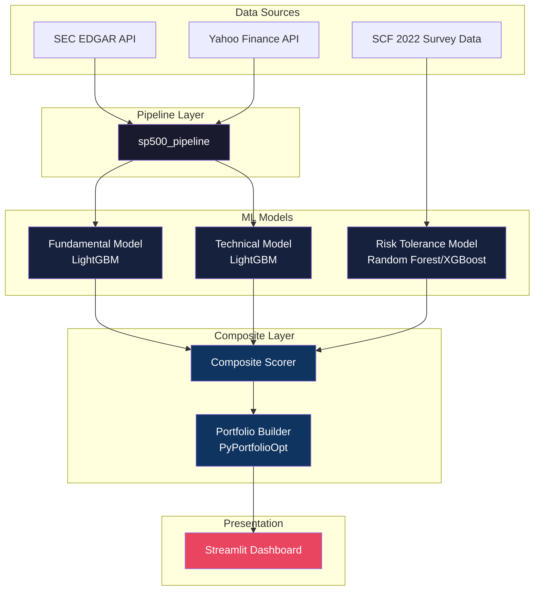
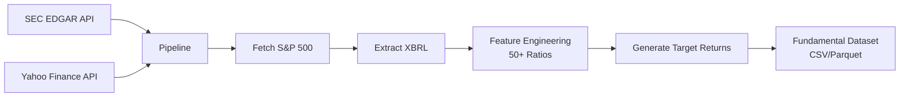
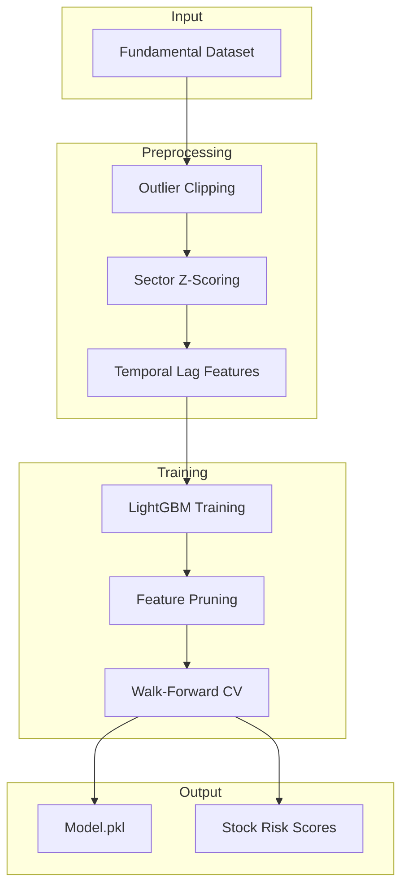
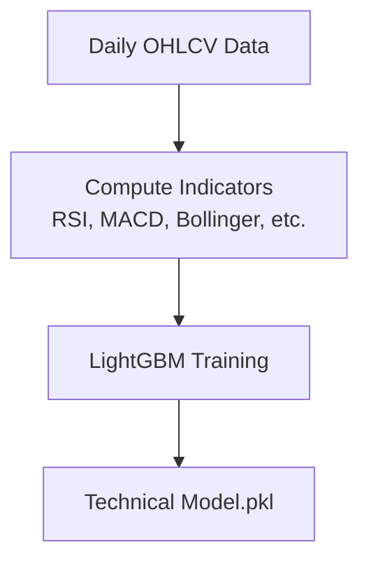
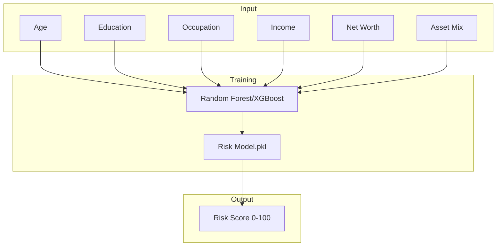
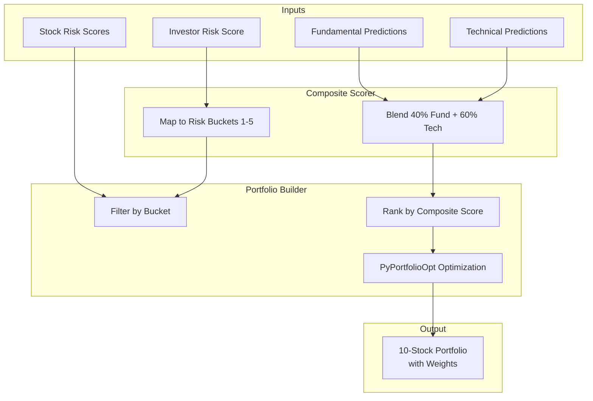
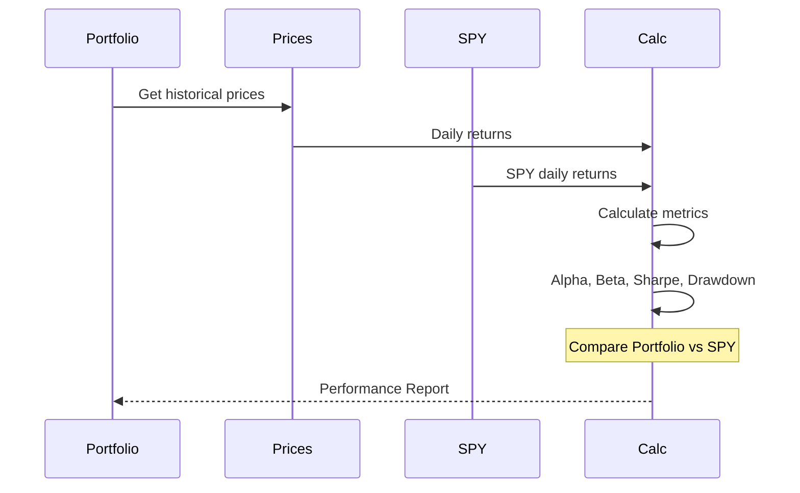
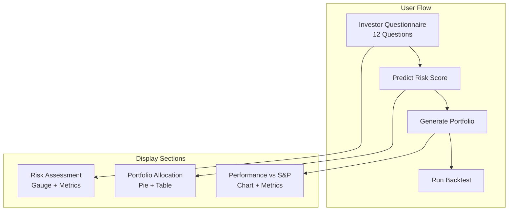

# 📊 Predictive Asset Allocation System

An end-to-end, AI-powered investment platform that orchestrates data retrieval, machine learning, and risk-matched portfolio optimization for the S&P 500 universe.

---

## 🏗️ System Architecture



---

## 📂 Project Structure

```
.
├── sp500_pipeline/          # Data ingestion & ETL from SEC EDGAR
├── sp500_ml/                 # Fundamental analysis ML model
├── sp500_technical/         # Technical analysis ML model
├── risk prediction/         # Investor risk tolerance model
├── composite/               # Portfolio construction & optimization
├── gui/                     # Streamlit web interface
│   ├── components/          # UI components (charts, tables, etc.)
│   ├── core/                # Business logic (portfolio, backtest)
│   └── styles/              # Custom CSS theming
├── output/                  # Fundamental model outputs
├── output_technical/       # Technical model outputs
├── output_composite/        # Portfolio outputs
└── daily_prices_all.csv     # Historical price data
```

---

## 🔄 How It Works

### 1. Data Pipeline (`sp500_pipeline`)



**Key Features:**
- Fetches company list from S&P 500
- Extracts XBRL financial statements (Balance Sheet, Income Statement, Cash Flow)
- Computes 50+ financial ratios (ROE, Debt-to-Equity, Operating Margin, etc.)
- Generates forward-looking excess returns relative to SPY

---

### 2. ML Models

#### 2.1 Fundamental Model (`sp500_ml`)



**Process:**
1. Preprocessing: Outlier clipping, sector-based z-scoring, temporal lag features
2. Two-pass training to identify high-impact features
3. Walk-forward cross-validation for robust validation
4. Generates Stock Risk Scores (0-100) based on model uncertainty, volatility, sector stability

#### 2.2 Technical Model (`sp500_technical`)



**Indicators Used:**
- RSI (Relative Strength Index)
- MACD (Moving Average Convergence/Divergence)
- Bollinger Bands
- Moving Average Crossovers
- ADX (Average Directional Index)
- Volume Profiles

#### 2.3 Risk Tolerance Model (`risk prediction`)



**Description:**
- **Source:** 2022 Survey of Consumer Finances (SCF) dataset with ~30,000 households
- **Model:** Random Forest / XGBoost classifier
- **Features:** Age, Education, Occupation, Income, Net Worth, Asset Mix
- **Output:** 0-100 Investor Risk Score

---

### 3. Composite Scoring & Portfolio Construction (`composite`)



**Risk Buckets:**
| Bucket | Description | Profile |
|--------|-------------|---------|
| 1 | Ultra-Conservative | Low volatility, high stability |
| 2 | Conservative | Moderate risk |
| 3 | Moderate | Balanced |
| 4 | Growth | Higher risk, higher return |
| 5 | Ultra-Aggressive | High momentum, high volatility |

**Key Features:**
- Weighted blending of Fundamental (40%) and Technical (60%) predictions
- Maps investor risk score to appropriate stock risk buckets
- Uses PyPortfolioOpt for mean-variance optimization
- Generates exactly 10 stocks in the portfolio

---

### 4. Backtesting



**Metrics Calculated:**
- Annual Return (%)
- Annual Volatility (%)
- Sharpe Ratio
- Alpha (%)
- Beta
- Maximum Drawdown (%)
- Outperformance vs S&P 500

---

### 5. GUI Dashboard (`gui`)



**Questionnaire Fields:**
1. Age (18-85)
2. Education Level
3. Occupation Status
4. Annual Income Range
5. Net Worth Range
6. Total Assets Range
7. Emergency Fund (Yes/No)
8. Savings Account (Yes/No)
9. Mutual Funds (Yes/No)
10. Retirement Account (Yes/No)
11. Investment Capital

**Display Layout:**
1. **Risk Assessment** - Gauge showing risk score (0-100), category, equity allocation
2. **Portfolio Allocation** - Pie chart and table of 10 stocks with weights
3. **Performance vs S&P 500** - Line chart comparing portfolio vs SPY, metrics table

---

## 🚀 Getting Started

### Prerequisites
- Python 3.9+
- SEC User-Agent string (configured in `sp500_pipeline/config.py`)

### Installation

```bash
# Clone repository
git clone <repository-url>
cd predictive-asset-allocation

# Install dependencies
pip install -r requirements.txt
pip install -r gui/requirements.txt
```

### Running the System

```bash
# 1. Run data pipeline (if needed)
python run_pipeline.py

# 2. Train fundamental model
python run_ml.py

# 3. Train technical model
python run_technical.py

# 4. Generate portfolios
python run_composite.py --profile moderate

# 5. Launch dashboard
streamlit run gui/app.py
```

### Quick Start (Dashboard Only)

If data and models are already generated:

```bash
streamlit run gui/app.py
```

---

## 📊 Portfolio Examples

### Conservative Profile (Risk Score ≤ 35)
- Lower equity allocation
- Focus on stable, low-volatility stocks
- Smaller exposure to growth buckets

### Moderate Profile (Risk Score 36-50)
- Balanced equity allocation
- Mix of stability and growth
- Optimal risk-return tradeoff

### Aggressive Profile (Risk Score > 70)
- Higher equity allocation
- Focus on high-momentum stocks
- Allocations to higher-risk buckets

---

## 📈 Performance Validation

- **Information Coefficient (IC)** for model quality
- **Decile Spread** for ranking effectiveness
- **Backtest Comparison**: Portfolio vs S&P 500 (SPY)
- **Metrics**: Sharpe Ratio, Sortino Ratio, Maximum Drawdown

---

## ⚠️ Disclaimer

This software is for educational and research purposes only. It does not constitute financial advice. Always consult with a certified financial advisor before making investment decisions.

---

## 📁 Key Files

| File | Description |
|------|-------------|
| `run_pipeline.py` | Data ingestion from SEC EDGAR |
| `run_ml.py` | Train fundamental model |
| `run_technical.py` | Train technical model |
| `run_composite.py` | Build portfolios |
| `run_backtest.py` | Run backtests |
| `gui/app.py` | Streamlit dashboard entry point |
| `requirements.txt` | Python dependencies |
| `gui/requirements.txt` | GUI dependencies |

---

## 🛠️ Technology Stack

- **Data Processing**: pandas, numpy
- **ML Models**: LightGBM, XGBoost, Random Forest
- **Optimization**: PyPortfolioOpt
- **Visualization**: Plotly, Streamlit
- **Data Sources**: SEC EDGAR, Yahoo Finance, SCF 2022