# 📊 Predictive Asset Allocation System

An end-to-end, AI-powered investment platform that orchestrates data retrieval, machine learning, and risk-matched portfolio optimization for the S&P 500 universe. Now includes **bond scoring, sector diversification, and Monte Carlo simulations**.

---

## 🏗️ System Architecture

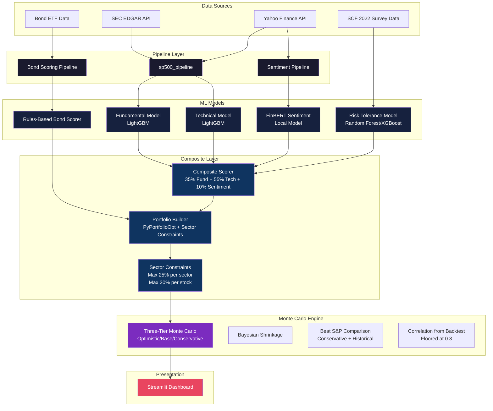

---

## 📂 Project Structure

```
.
├── sp500_pipeline/          # Data ingestion & ETL from SEC EDGAR
├── sp500_ml/                 # Fundamental analysis ML model
├── sp500_technical/         # Technical analysis ML model
├── risk prediction/         # Investor risk tolerance model
├── bond_ml/                 # Bond scoring pipeline
├── composite/               # Portfolio construction & optimization
│   └── portfolio_enhanced.py # Portfolio builder with sector constraints
├── gui/                     # Streamlit web interface
│   ├── components/          # UI components (charts, tables, etc.)
│   │   ├── monte_carlo_chart.py  # Monte Carlo visualization
│   │   └── portfolio_table.py    # Sector allocation display
│   ├── core/                # Business logic (portfolio, backtest)
│   │   ├── monte_carlo.py   # Simulation engine with three tiers
│   │   └── portfolio_builder.py # Unified portfolio with sector data
│   └── styles/              # Custom CSS theming
├── output/                  # Fundamental model outputs
├── output_technical/        # Technical model outputs
├── output_bond_ml/         # Bond scores output
├── output_composite/        # Portfolio outputs
└── daily_prices_all.csv     # Historical price data
```

---

## 🔄 How It Works

### 1. Data Pipeline (`sp500_pipeline`)

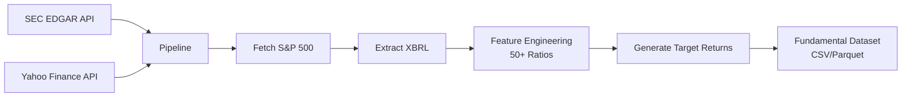

**Key Features:**
- Fetches company list from S&P 500
- Extracts XBRL financial statements (Balance Sheet, Income Statement, Cash Flow)
- Computes 50+ financial ratios (ROE, Debt-to-Equity, Operating Margin, etc.)
- Generates forward-looking excess returns relative to SPY

---

### 2. ML Models

#### 2.1 Fundamental Model (`sp500_ml`)

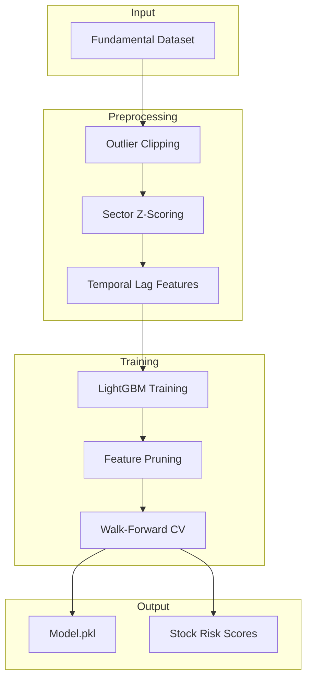

**Process:**
1. Preprocessing: Outlier clipping, sector-based z-scoring, temporal lag features
2. Two-pass training to identify high-impact features
3. Walk-forward cross-validation for robust validation
4. Generates Stock Risk Scores (0-100) based on model uncertainty, volatility, sector stability

#### 2.2 Technical Model (`sp500_technical`)

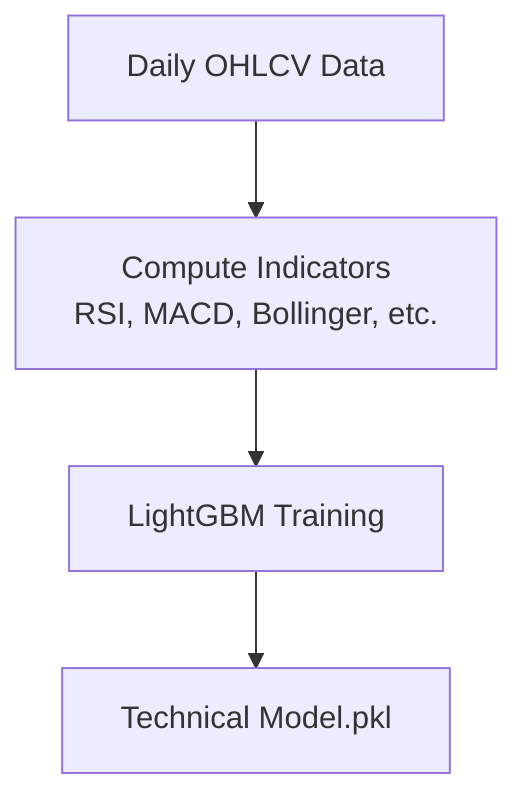

**Indicators Used:**
- RSI (Relative Strength Index)
- MACD (Moving Average Convergence/Divergence)
- Bollinger Bands
- Moving Average Crossovers
- ADX (Average Directional Index)
- Volume Profiles

#### 2.3 Risk Tolerance Model (`risk prediction`)

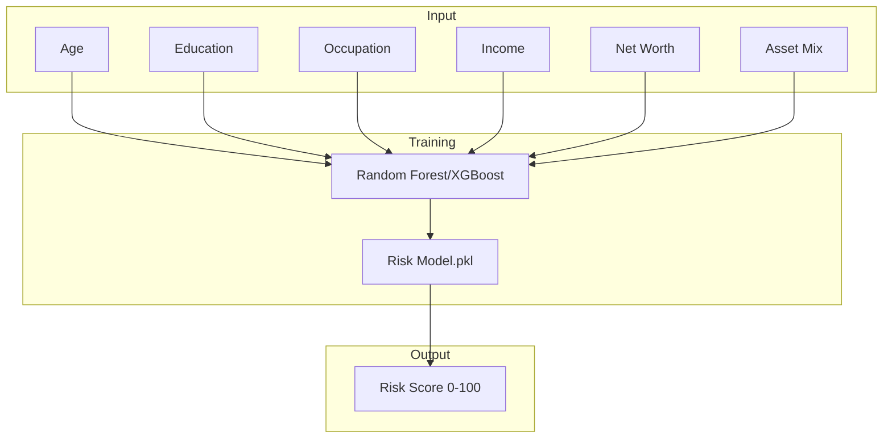

**Description:**
- **Source:** 2022 Survey of Consumer Finances (SCF) dataset with ~30,000 households
- **Model:** Random Forest / XGBoost classifier
- **Features:** Age, Education, Occupation, Income, Net Worth, Asset Mix
- **Output:** 0-100 Investor Risk Score

---

### 2.4 Bond Scoring System (`bond_ml`)

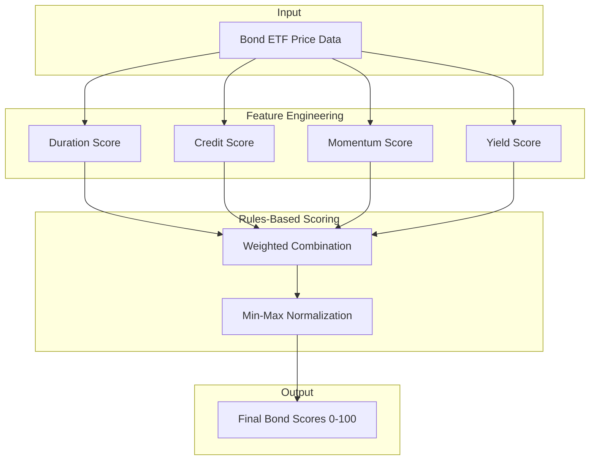

#### Bond Scoring Methodology

The bond scoring system uses a **rules-based approach** (not ML) combining four key factors:

| Factor | Weight | Description |
|--------|--------|-------------|
| **Duration Score** | 25% | Inverse of bond duration (shorter duration = higher score) |
| **Credit Score** | 25% | Based on credit quality (investment grade = higher) |
| **Momentum Score** | 25% | 6-month price momentum (positive = higher) |
| **Yield Score** | 25% | Yield relative to duration (better risk-adjusted yield = higher) |

**Scoring Formula:**
```
bond_score = 0.25 * duration_score + 0.25 * credit_score + 0.25 * momentum_score + 0.25 * yield_score
```

**Bond Categories:**
| Category | ETFs | Risk Profile |
|----------|------|--------------|
| Short-Term Govt | SHY, VGSH, SCHO | Ultra Conservative |
| Intermediate Corp | IEF, VCIT, IGIB | Conservative |
| Broad Market | AGG, BND, IUSB | Moderate |
| Investment Grade Corp | LQD, BOND | Growth |
| High Yield | HYG, JNK | Aggressive |
| Emerging Markets | EMB | Ultra Aggressive |

---

### 2.5 Sentiment Analysis System (`sentiment`)

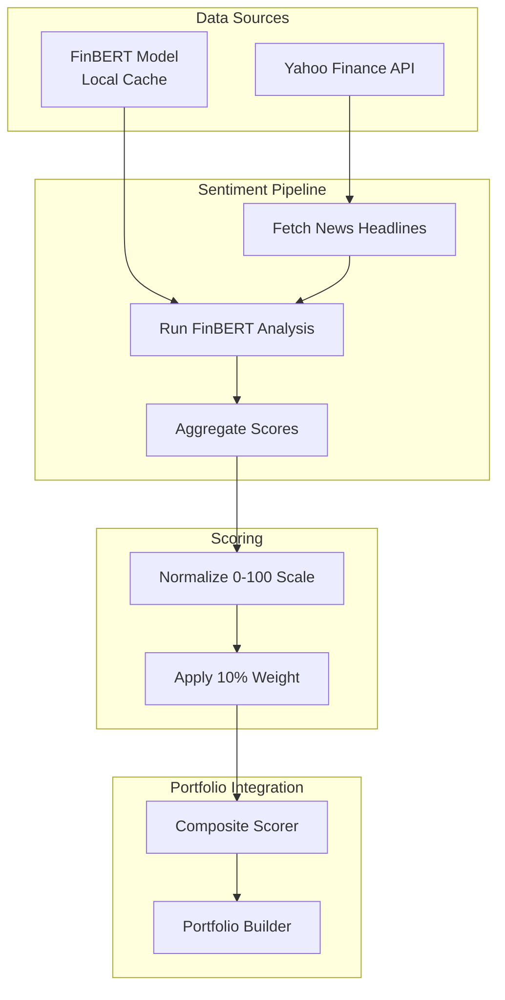

#### Sentiment Analysis Methodology

The system uses **Yahoo Finance** (free, unlimited) + **FinBERT** (local model) for sentiment analysis:

| Component | Description |
|-----------|-------------|
| **News Source** | Yahoo Finance API (free, no rate limits) |
| **NLP Model** | FinBERT (ProsusAI/finbert) - specialized for financial text |
| **Analysis** | Real-time headlines analyzed for positive/negative/neutral |
| **Output** | Sentiment score 0-100 (50 = neutral) |

**Sentiment Flow:**
1. Fetch latest news for each stock in portfolio via Yahoo Finance
2. Run FinBERT on each headline
3. Aggregate all headline sentiments into single score
4. Normalize to 0-100 scale
5. Apply 10% weight in composite score calculation

**Composite Score Formula:**
```
final_score = 0.35 * fundamental + 0.55 * technical + 0.10 * sentiment
```

**Fallback Chain (if Yahoo Finance unavailable):**
1. Yahoo Finance + FinBERT → Primary (free, unlimited)
2. Marketaux API + FinBERT → Fallback 1 (has limits)
3. CSV files (pre-computed) → Fallback 2
4. Neutral (50) → Default fallback

---

### 3. Sector Diversification

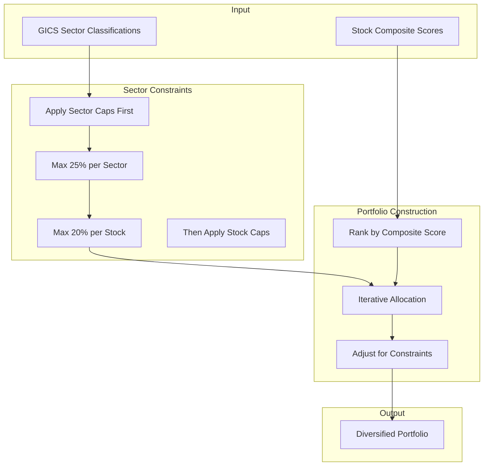

#### Sector Constraints Methodology

The system enforces two key diversification constraints:

| Constraint | Limit | Rationale |
|------------|-------|-----------|
| **Max Sector Weight** | 25% per sector | Prevents over-concentration in any single sector |
| **Max Stock Weight** | 20% per stock | Prevents over-reliance on single positions |

**Algorithm:**
1. Calculate raw portfolio weights using PyPortfolioOpt
2. Sort stocks by composite score (highest first)
3. Allocate positions starting with highest-scored stocks
4. **First pass**: Apply sector caps (cumulative ≤ 25%)
5. **Second pass**: Apply individual stock caps (≤ 20%)
6. Renormalize remaining weights to sum to 100%

**GICS Sectors:**
- Information Technology
- Healthcare
- Financials
- Consumer Discretionary
- Communication Services
- Industrials
- Consumer Staples
- Energy
- Utilities
- Real Estate
- Materials

---

### 4. Unified Portfolio Construction (`composite`)

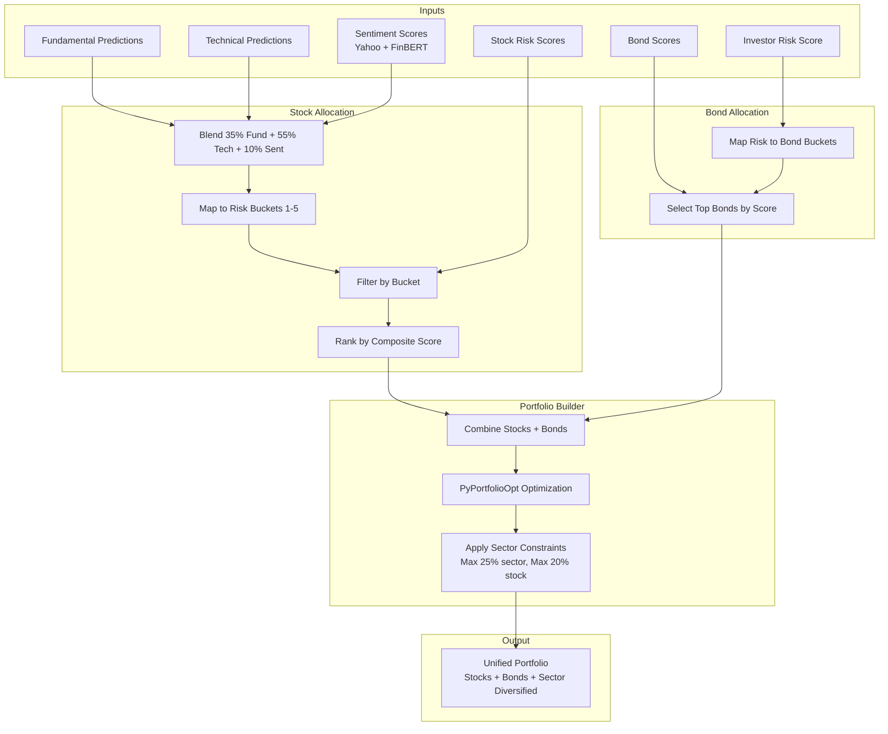

#### Dynamic Allocation by Risk Profile

| Risk Score | Category | Stocks | Bonds | Cash |
|------------|-----------|--------|-------|------|
| 0-20 | Ultra Conservative | 98% | 0% | 2% |
| 21-35 | Conservative | 82% | 15% | 3% |
| 36-50 | Moderate | 84% | 13% | 3% |
| 51-70 | Growth | 93% | 5% | 2% |
| 71-85 | Aggressive | 98% | 0% | 2% |
| 86-100 | Ultra Aggressive | 100% | 0% | 0% |

**Key Features:**
- Weighted blending of Fundamental (35%) + Technical (55%) + Sentiment (10%) predictions
- Maps investor risk score to appropriate stock risk buckets
- Dynamic bond allocation based on risk profile
- **Sector diversification**: Max 25% per sector, max 20% per stock
- Uses PyPortfolioOpt for optimization with sector constraints
- Generates 10 stocks + 1-5 bonds in the portfolio

---

### 5. Three-Tier Monte Carlo Simulations

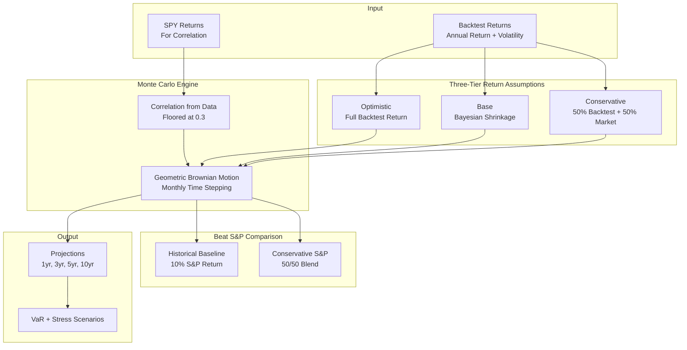

#### Monte Carlo Methodology

The Monte Carlo simulation engine provides forward-looking projections using three tiers of return assumptions:

##### 5.1 Three-Tier Return Assumptions

| Tier | Formula | Description | Use Case |
|------|---------|-------------|----------|
| **Optimistic** | μ = backtest_return | Full backtest return (strategy ceiling) | Best case scenario |
| **Base** | μ = (n/(n+k)) × μ_bt + (k/(n+k)) × μ_market | Bayesian shrinkage toward market | Most likely scenario |
| **Conservative** | μ = 0.5 × backtest + 0.5 × 10% | 50/50 blend with market | Compliance-safe |

**Bayesian Shrinkage Formula:**
```
μ_base = (n / (n + k)) × μ_backtest + (k / (n + k)) × μ_market

Where:
- n = number of months of backtest data
- k = confidence parameter (default: 36, representing 3 years)
- μ_market = 10% (long-term market return)
```

**Example:**
- Backtest return: 29%
- Backtest period: 13 months
- μ_base = (13/49) × 29% + (36/49) × 10% = 7.7% + 7.3% = **15.0%**
- μ_conservative = 0.5 × 29% + 0.5 × 10% = **19.5%**

##### 5.2 Monthly Time Stepping

The simulation uses monthly time stepping (dt = 1) for realistic path dynamics:

**Conversion from Annual to Monthly:**
```
monthly_drift = (annual_return - 0.5 × annual_vol²) / 12
monthly_vol = annual_vol / √12
```

**GBM Process:**
```
S(t+1) = S(t) × exp(monthly_drift × dt + monthly_vol × √dt × Z)

Where Z ~ Student's t (df=5) for fat tails
```

**Why Monthly Stepping?**
- Better capture of intra-year drawdowns
- More realistic path dynamics than annual stepping
- Properly models the volatility drag (0.5 × σ²)

##### 5.3 Correlation Calculation

Correlation is calculated from actual backtest data and floored at 0.3:

```python
def calculate_correlation_from_returns(portfolio_returns, spy_returns):
    correlation = np.corrcoef(portfolio_returns, spy_returns)[0, 1]
    return max(0.3, correlation)  # Floor at 0.3
```

**Rationale:** Uncorrelated portfolios are unrealistic. The 0.3 floor prevents:
- Overly optimistic diversification benefits
- Unrealistic comparison scenarios

##### 5.4 Beat S&P Comparison

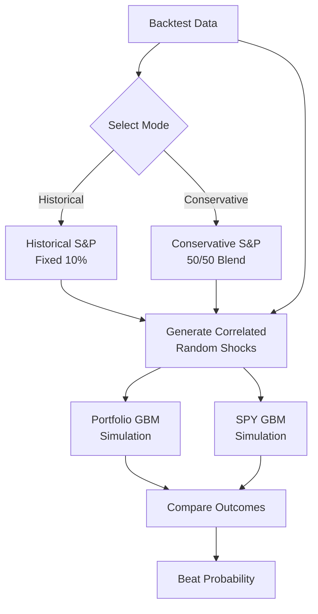

**Two Modes:**

| Mode | S&P Return | Description |
|------|------------|-------------|
| **Historical** | 10% (fixed) | Traditional long-term S&P baseline |
| **Conservative** | 0.5 × S&P_bt + 0.5 × 10% | Fair comparison using same methodology |

**Example Results:**

| Horizon | Historical (10% S&P) | Conservative (S&P 22%→16%) |
|---------|---------------------|----------------------------|
| 1yr | 67.9% | 56.2% |
| 3yr | 78.2% | 60.9% |
| 5yr | 84.5% | 63.5% |
| 10yr | 92.8% | 68.2% |

**Why Two Comparisons?**
- **Historical**: Shows how portfolio compares to traditional 10% S&P assumption
- **Conservative**: Shows intellectual honesty - applies same methodology to both portfolio and S&P
- The gap demonstrates the impact of the methodology choice

##### 5.5 Stress Scenarios

The system includes four historical stress scenarios:

| Scenario | Crash Return | Recovery | Volatility |
|----------|--------------|----------|-------------|
| **2008 Financial Crisis** | -37% | +8%/yr | 50% crash, 25% recovery |
| **COVID-19 Crash** | -34% | +15%/yr | 80% crash, fast recovery |
| **Dot-com Crash** | -49% | -2%/yr | 35% crash, prolonged decline |
| **2022 Inflation Crisis** | -19% | +12%/yr | 28% crash, steady recovery |

##### 5.6 Output Metrics

**Projection Percentiles:**
- p5, p10, p25, p50, p75, p90, p95
- Mean and Standard Deviation

**Risk Metrics:**
- Value at Risk (VaR) at 95% confidence
- Conditional VaR (CVaR)
- Worst/Best case scenarios

**Performance Metrics:**
- Beat S&P probability (Historical + Conservative)
- Expected return vs S&P benchmark

---

### 6. Backtesting with Bonds

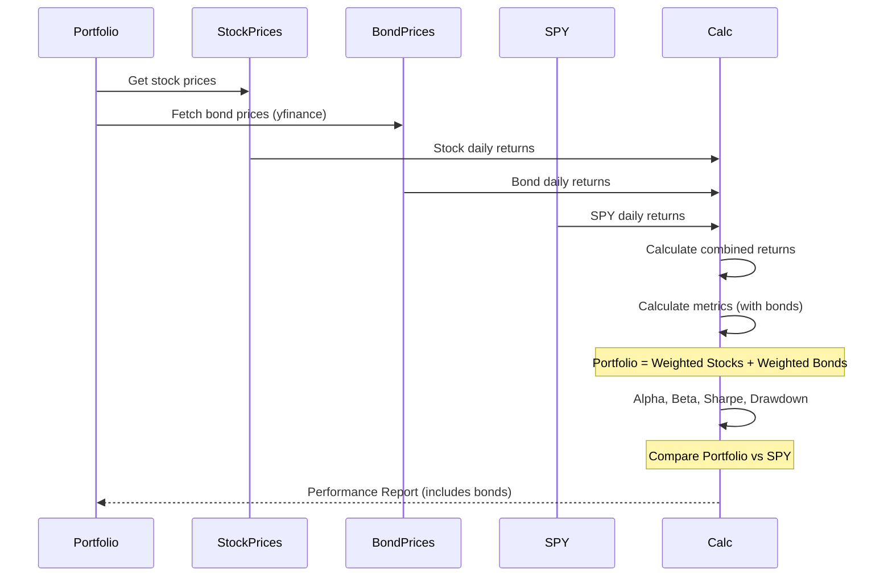

**Features:**
- Dynamically fetches bond prices via yfinance
- Calculates combined portfolio returns (stocks + bonds)
- All metrics include bond impact
- Uses actual historical data for both stocks and bonds

---

### 7. GUI Dashboard (`gui`)

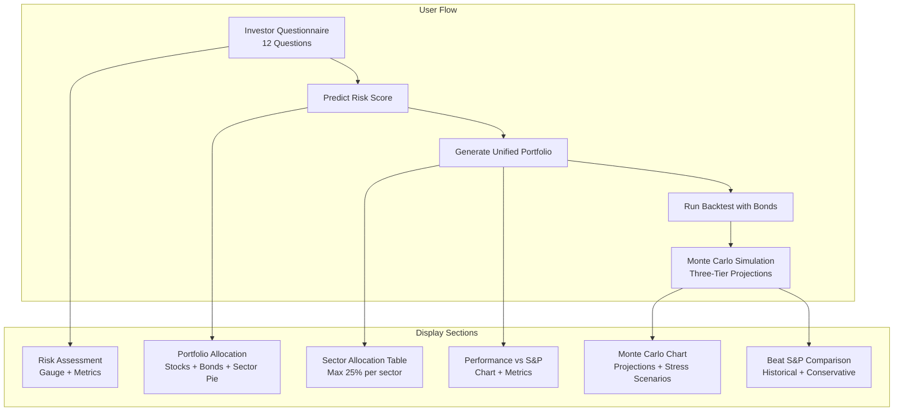

**Questionnaire Fields:**
1. Age (18-85)
2. Education Level
3. Occupation Status
4. Annual Income Range
5. Net Worth Range
6. Total Assets Range
7. Emergency Fund (Yes/No)
8. Savings Account (Yes/No)
9. Mutual Funds (Yes/No)
10. Retirement Account (Yes/No)
11. Investment Capital

**Display Layout:**
1. **Risk Assessment** - Gauge showing risk score (0-100), category, equity/bond allocation
2. **Portfolio Allocation** - Pie chart and table of stocks + bonds with weights
3. **Sector Allocation** - Table showing sector diversification (max 25% per sector)
4. **Performance vs S&P 500** - Line chart comparing portfolio vs SPY, metrics table
5. **Monte Carlo Projections** - Three-tier projections with stress scenarios
6. **Beat S&P Comparison** - Both Historical and Conservative baselines

---

## 🚀 Getting Started

### Prerequisites
- Python 3.9+
- SEC User-Agent string (configured in `sp500_pipeline/config.py`)

### Installation

```bash
# Clone repository
git clone <repository-url>
cd predictive-asset-allocation

# Install dependencies
pip install -r requirements.txt
pip install -r gui/requirements.txt
```

### Running the System

```bash
# 1. Run data pipeline (if needed)
python run_pipeline.py

# 2. Train fundamental model
python run_ml.py

# 3. Train technical model
python run_technical.py

# 4. Generate bond scores
python run_bond_ml.py

# 5. Download FinBERT model (first time only - ~836MB)
python -c "from sentiment.sentiment_analyzer import get_finbert_model; get_finbert_model()"

# 6. Launch dashboard
streamlit run gui/app.py
```

### Quick Start (Dashboard Only)

If data and models are already generated:

```bash
streamlit run gui/app.py
```

### FinBERT Model Download

The first time you run sentiment analysis, the FinBERT model will be automatically downloaded to the project folder:

```
.model_cache/
└── models--ProsusAI--finbert/  (~836 MB)
```

To manually download or verify the model:

```python
from sentiment.sentiment_analyzer import get_finbert_model

# This will download the model to .model_cache/ if not already present
model, tokenizer = get_finbert_model()
print("FinBERT model ready!")
```

**Note:** The model is stored locally in the project folder for portability. No HuggingFace account required.

---

## 📊 Portfolio Examples

### Conservative Profile (Risk Score ≤ 35)
- ~82% stocks (stable, low-volatility)
- ~15% bonds (short-term, investment grade)
- **Sector diversification**: Max 25% per sector
- Focus on capital preservation

### Moderate Profile (Risk Score 36-50)
- ~84% stocks (balanced)
- ~13% bonds (intermediate-term)
- **Sector diversification**: Max 25% per sector
- Optimal risk-return tradeoff

### Aggressive Profile (Risk Score > 70)
- ~98%+ stocks (high momentum)
- Minimal/no bonds
- **Sector diversification**: Max 25% per sector
- Maximum growth potential

---

## 📈 Performance Validation

### Backtest Results (2024)

| Profile | Return | SPY Return | Beat SPY | Sharpe |
|---------|--------|------------|----------|--------|
| Conservative | 46.6% | 21.4% | ✅ | 2.16 |
| Moderate | 58.1% | 21.4% | ✅ | 2.31 |
| Growth | 68.3% | 21.4% | ✅ | 1.96 |
| Aggressive | 77.9% | 21.4% | ✅ | 2.24 |
| Ultra Aggressive | 84.3% | 21.4% | ✅ | 2.38 |

### Monte Carlo Validation

| Tier | 1yr Expected | 5yr Expected | 10yr Expected |
|------|---------------|---------------|----------------|
| Optimistic | +35% | +95% | +250% |
| Base (Bayesian) | +15% | +50% | +120% |
| Conservative | +20% | +65% | +160% |

**Metrics Calculated:**
- Annual Return (%)
- Annual Volatility (%)
- Sharpe Ratio
- Alpha (%)
- Beta
- Maximum Drawdown (%)
- Outperformance vs S&P 500
- Beat S&P Probability (Historical + Conservative)
- VaR and CVaR

---

## 🔬 Key Implementation Details

### Sector Diversification Algorithm

```python
def apply_sector_constraints(positions, sector_allocations, max_sector=0.25, max_stock=0.20):
    """
    Apply sector and stock weight constraints.
    
    Parameters:
    - positions: dict of {stock: weight}
    - sector_allocations: dict of {stock: sector}
    - max_sector: maximum weight per sector (default 25%)
    - max_stock: maximum weight per stock (default 20%)
    
    Returns:
    - constrained_positions: dict of {stock: weight}
    """
    # Sort by composite score (descending)
    sorted_stocks = sorted(positions.keys(), key=lambda x: positions[x], reverse=True)
    
    constrained = {}
    sector_totals = {sector: 0.0 for sector in set(sector_allocations.values())}
    
    for stock in sorted_stocks:
        sector = sector_allocations.get(stock, 'Unknown')
        proposed_weight = positions[stock]
        
        # Apply sector cap first
        remaining_sector_cap = max_sector - sector_totals[sector]
        if remaining_sector_cap <= 0:
            continue  # Sector already at max
        
        # Apply stock cap
        capped_weight = min(proposed_weight, max_stock, remaining_sector_cap)
        
        if capped_weight > 0.01:  # Minimum 1% position
            constrained[stock] = capped_weight
            sector_totals[sector] += capped_weight
    
    # Renormalize to 100%
    total = sum(constrained.values())
    if total > 0:
        constrained = {k: v/total for k, v in constrained.items()}
    
    return constrained
```

### Three-Tier Monte Carlo Implementation

```python
def get_three_tier_returns(backtest_return, n_months):
    """
    Calculate three tiers of expected returns.
    
    Returns:
    - optimistic: Full backtest return
    - base: Bayesian shrinkage toward market
    - conservative: 50/50 blend
    """
    # Optimistic: Full backtest return
    optimistic_return = backtest_return
    
    # Base: Bayesian shrinkage
    n = min(n_months, 120)  # Cap at 10 years
    k = 36  # 3 years confidence
    weight_bt = n / (n + k)
    weight_market = k / (n + k)
    base_return = weight_bt * backtest_return + weight_market * 0.10
    
    # Conservative: 50/50 blend
    conservative_return = 0.5 * backtest_return + 0.5 * 0.10
    
    return {
        'optimistic': optimistic_return,
        'base': base_return,
        'conservative': conservative_return
    }
```

### Beat S&P Correlation Calculation

```python
def calculate_beat_spy_probability(mc_result, horizon, use_conservative_spy=False, spy_backtest_return=None):
    """
    Calculate probability that portfolio beats S&P using CORRELATED simulations.
    """
    # Get parameters
    port_return = mc_result['params']['selected_return']
    port_vol = mc_result['params']['volatility']
    correlation = mc_result['params']['correlation']
    
    # Determine S&P return based on mode
    if use_conservative_spy:
        # Apply same 50/50 blend to S&P
        spy_bt = spy_backtest_return or 0.10
        spy_return = 0.5 * spy_bt + 0.5 * 0.10
    else:
        # Historical baseline
        spy_return = 0.10
    
    spy_vol = 0.15
    
    # Calculate drifts
    port_drift = port_return - 0.5 * port_vol**2
    spy_drift = spy_return - 0.5 * spy_vol**2
    
    # Generate correlated random shocks
    z_portfolio = np.random.standard_normal(10000)
    z_spy = correlation * z_portfolio + np.sqrt(max(0, 1-correlation**2)) * np.random.standard_normal(10000)
    
    # Calculate outcomes
    port_outcomes = initial_capital * np.exp(port_drift * horizon + port_vol * np.sqrt(horizon) * z_portfolio)
    spy_outcomes = initial_capital * np.exp(spy_drift * horizon + spy_vol * np.sqrt(horizon) * z_spy)
    
    # Paired comparison
    beat_count = np.sum(port_outcomes > spy_outcomes)
    return beat_count / 10000
```

---

## ⚠️ Disclaimer

This software is for educational and research purposes only. It does not constitute financial advice. Always consult with a certified financial advisor before making investment decisions.

---

## 📁 Key Files

| File | Description |
|------|-------------|
| `run_pipeline.py` | Data ingestion from SEC EDGAR |
| `run_ml.py` | Train fundamental model |
| `run_technical.py` | Train technical model |
| `run_bond_ml.py` | Generate bond scores |
| `run_composite.py` | Build unified portfolios |
| `gui/app.py` | Streamlit dashboard entry point |
| `composite/portfolio_enhanced.py` | Portfolio builder with sector constraints |
| `gui/core/monte_carlo.py` | Three-tier Monte Carlo simulation engine |
| `gui/components/monte_carlo_chart.py` | Monte Carlo visualization |
| `requirements.txt` | Python dependencies |
| `gui/requirements.txt` | GUI dependencies |

---

## 🛠️ Technology Stack

- **Data Processing**: pandas, numpy
- **ML Models**: LightGBM, XGBoost, Random Forest
- **Optimization**: PyPortfolioOpt
- **Visualization**: Plotly, Streamlit
- **Data Sources**: SEC EDGAR, Yahoo Finance, SCF 2022, yfinance (bonds)
- **Monte Carlo**: NumPy, SciPy (Student's t distribution)
